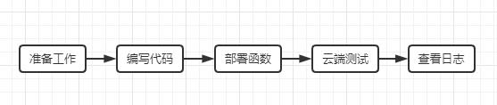
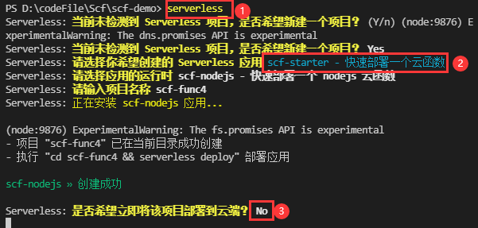
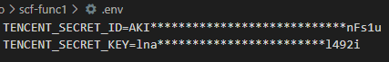
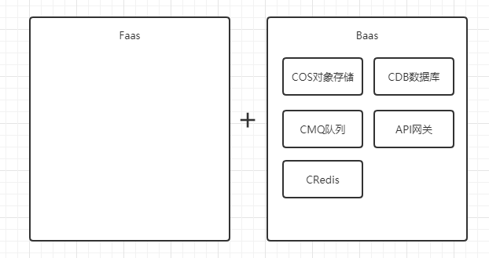
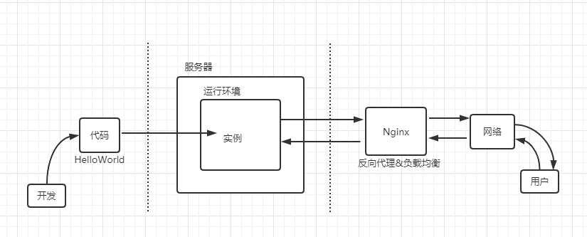
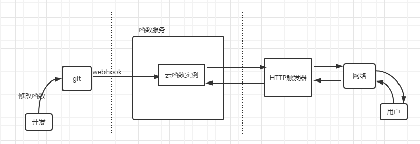
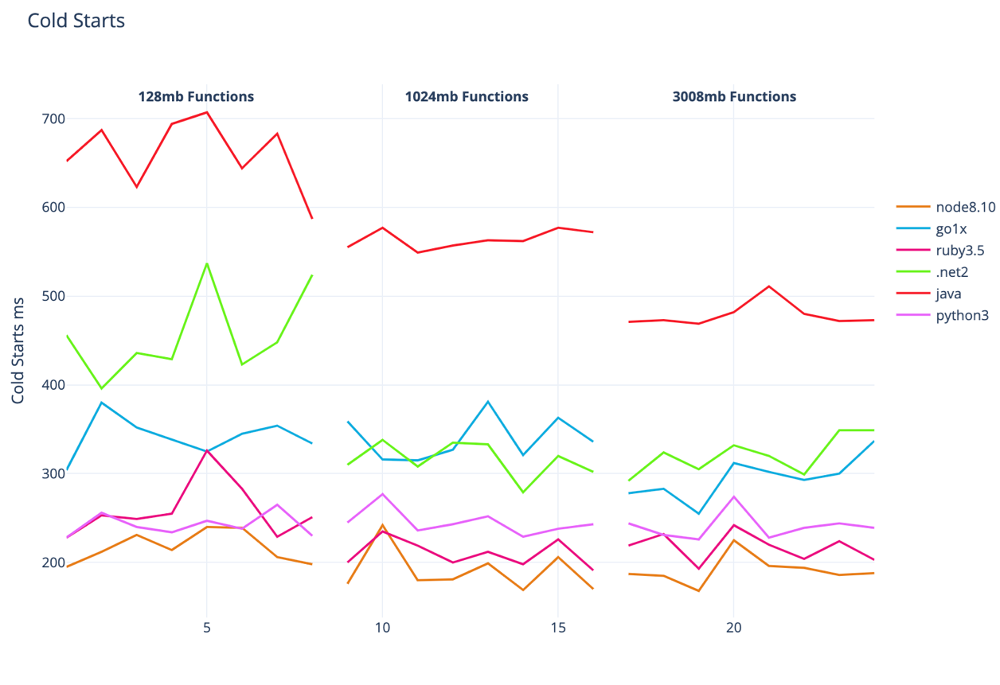

初探云函数

文章分成三个部分

# 1.第一个云函数(CLI部署)  

  
1.准备工作：本地执行【npm i -g serverless】全局安装云函数需要的基础框架Serverless FrameWork CLI
2.当目录中不存在serverless.yml的配置文件时，执行【serverless】初始化云函数。初始化完成后暂时不部署到云端  
  
3.创建完成后，默认生成了index.js和serverless.yml两个文件，index.js是云函数的入口函数，serverless.yml则是云函数的配置文件，本地开发完成后的项目，必须先配置yml文件，才可以运行【serverless deploy】命令，将 serverless.yml 中的配置文件和 inputs 中指定参数或代码目录会都被传入 Serverless Components 部署引擎中，从而完成云端部署。

4.权限管理：部署前，需要完成授权，初始化完成不马上部署是为了修改授权方式。默认通过serverless指令创建的云函数部署到云端需要扫码授权验证身份，为了避免扫码授权过期进行重复授权，这里修改为密钥授权的方式。在部署的根目录下创建 【.env】 文件，并配置腾讯云的 SecretId（用于标识API调用者身份） 和 SecretKey （用于加密签名字符串和服务器端验证签名字符串的密钥。）信息。SecretId和SecretKey可以到API密钥管理中配置。API密钥管理   

  

5.执行默认配置下，部署到云端的云函数会自动分配一个API网关触发器

2.

# 2. 原理部分

## 2.什么是Serverless？（服务端免运维）
Serverless是一种无服务的架构理念，基于Serverless Framework完成，无服务器并不是说不需要服务器，只是服务器的管理与资源分配无需用户关系（简单来说就是不要你管），用户只需要编写对应的函数，提交到对应平台，然后配置对应的触发器即可。Serverless包含Faas和Baas两部分

Baas（后台即服务）是指我们不再编写或管理所有服务端组件，比如项目中我们依赖的第三方服务，如DB、MQ、Redis等，Baas平台将这些依赖的服务服务化并发布出来。用户在平台上申请资源，只需要对所需要的服务支付费用，而不需要关心这些服务具体的运维。一个比较典型的例子是数据库即服务（Database as a Service，DBaaS）。许多应用都有存储数据的需求，大部分应用会将数据存储在数据库中。传统情况下，都是由用户运维团队负责运维。在Baas的场景下，用户向 DBaaS 平台申请数据库资源，就不需要关心数据库的安装部署及运维

Faas（函数即服务），用Faas来描述云函数来说并不准确，云函数只是Faas服务运行的一个实例

  

TODO

## 3.什么是云函数？
简单来说，云函数可以理解为运行在云端（服务器端）上的函数。在物理设计上，一个云函数可由多个文件组成，占用一定量的 CPU 内存等计算资源；各云函数完全独立；可分别部署在不同的地区。开发者无需购买、搭建服务器，只需编写函数代码并部署到云端即可在小程序端调用，同时云函数之间也可互相调用。

1.1 为什么我们要用云函数？云函数与我们传统开发有何不同？

在 Serverless 出现之前，我们要部署一个"Hello World"。首先为了运行我们的应用，我们要在服务端构建代码的运行环境，我们要购买虚拟机，初始化虚拟机运行环境，安装我们需要的应用运行环境，尽量和本地开发环境保持一致；紧接着为了让用户能够访问我们刚刚启动的应用，我们需要购买域名，用虚拟机 IP 注册域名；配置 Nginx，启动 Nginx；最后我们还需要上传应用代码，部署应用。

Faas的执行流程

看了以上两图，我们可以发现Faas应用的调用是由函数触发器、函数服务、函数代码三部分组成。分别替代了传统服务端运维的负载均衡&反向代理，服务器&应用运行环境，应用代码部署。

云函数的特点？

TODO回到最初的例子，说明云函数几个特点
使用nodejs独有的特点，npm在线依赖安装

定义全局变量，验证云函数重用机制。需要保证云函数的无状态

3.什么是冷启动？
无服务器计算世界中，我们要求函数以按需方式运行，并在不需要时被及时弃用。这种仅在必要时运行函数的整个执行过程，即被称为冷启动。冷启动代表着代码在首次执行时所消耗的时长。这意味着相关代码需要进行下载、容器化、启动以及运行准备。此外，整个过程在语言性能方面存在着巨大差异

为什么目前云函数大多选择是nodejs？  

  

验证冷启动 TODO  例子

# 3.场景

云函数适合什么场景？
单一逻辑

云函数的好处

1.加快服务上线的时间，开发者仅需要实现具体的业务流程，上线部署的时间2分钟左右；

2.减少用户的运营负担，开发者无须承担服务扩容，故障恢复运维工作；

3.消除用户的资源成本，用户无需承担资源闲置费用，因为云函数只有在实际被调用时才会消耗付费。
